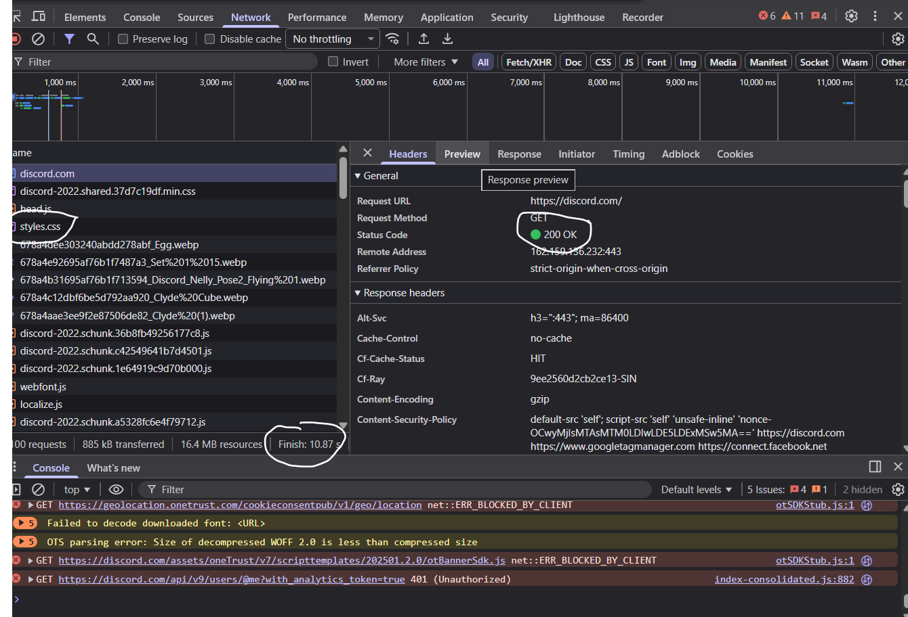
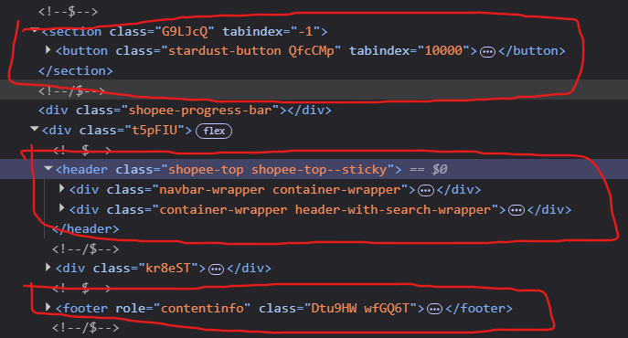

Câu A1  
a)Các bước xảy ra gồm:

1. Request đi từ laptop đến router tại nhà
2. Sau đó đi qua IPS
3. chạy đến server của shoppe thông qua cáp quang
4. Server xử lý request hiển thị lên Homepage
5. Sau đó repsonse được Server gửi ngược lại laptop
6. Trình duyệt nhận tập file HTML, CSS, JS sau đó render ra giao diện Homepage

b) Tab network trong devtool của Chrome cho ta thấy:

- Danh sách các request
- Chi tiết các thông tin của 1 request
- Các tài nguyên được gửi về (CSS,JS, IMG, FONT, etc)



Câu A2
Các lỗi semantic là:
Trang web bị GG đánh lỗi SEO thấp do, mắc phải các lỗi semantic, dùng các thẻ chưa đúng và chưa hợp lý, khiến cho trang web không được đánh giá cao.

Các lỗi semantic trong trang web là

1. Title của sản phẩm lại dùng thẻ div `<div>`, thay vào đó nên dùng thẻ heading để làm nổi bật tên sản phẩm
   ```html
   <div class="title">iPhone 16 Pro</div>
   ```
   sửa
   ```html
   <h2 class="title">iPhone 16 Pro</h2>
   ```
2. Khung bao bọc phần quan trọng nhất của trang web (sản phẩm) lại được bọc trong thẻ div với class là main`<div class="main">`, nên dùng thẻ main để trình duyệt biết dược đây là phần quan trọng nhất của trang web để tối ưu semantic

   ```html
   <div class="main">...</div>
   ```

   sửa

   ```html
   <main>...</main>
   ```

3. Thay vì bao bọc sản phẩm(product) bằng một thẻ div`<div class="product">`, ta thấy mỗi sản phẩm có thể là một nội dung riêng biệt, nên có thể dùng thẻ article để tối ưu.

   ```html
   <div class="product">...</div>
   ```

   sửa

   ```html
   <article class="title">...</article>
   ```

4. Ở phần giá tiền, ta thấy trang web đang dùng thẻ `<div class="price">`, nhưng thực tế giá tiền đó là một giá trị vậy để tối ưu ta có thể dùng thẻ data để hiển thị.
   ```html
   <div class="price">25.990.000đ</div>
   ```
   sửa
   ```html
   <data value="2599000">25.990.000đ</data>
   ```

Câu A3
Kết quả hiển thị

<pre> 
________________________________
|Hộp 1                         |
|Text A Text B                 |
|Hộp 2                         |
|Text C <strong>Text D</strong>                 |
|Hộp 3                         |
|                              |
|                              |
|                              |
--------------------------------
</pre>

Giải thích

- đối với các thẻ như `<div>` thì render ra trên browser text trong các thẻ sẽ xuống dòng vì vậy các nội dung như Hộp 1, Hộp 2 và Hộp 3 mới ở mỗi cái một dòng, tương tự với nội dung được bao bọng trong các thẻ đó

- đối với các thẻ như `<span>` thì thẻ này hoàn toàn có thể render trên cùng 1 dòng với các thẻ nội dung khác như vì vậy các nội dung như "Text A", "Text B" mới có thể đứng cùng 1 dòng

- đối với thẻ `<strong>` thẻ này render tương tự như thẻ `<span>` có thể ở cùng dòng với các nội dung khác nhưng thẻ này có nhiệm vụ in đậm text bên trong và nói cho browser biết đây là nội dung cần được chú ý.Phần A

Câu A4
Sự khác nhau giữa các thẻ `<thead>`, `<tbody>`, `<tfoot>`

- `<thead>`: dùng để thể hiện tiêu đề của bảng, thường chỉ được dùng 1 lần để ghi nội dung tiêu đề
- `<tfoot>`: dùng để thể hiện các dòng tổng kết các dữ liệu trong bảng (tổng tiền, tổng sinh viên, etc), thường xuất hiện ở dưới cùng của bảng
- `<tbody>`: dùng để chứa nội dung chính của bảng, có thể được dùng nhiều lần trong 1 bảng để chia dữ liệu thành các nhóm

Việc không sử dụng `<table>` để làm layout trang web là một quy tắc, bởi sử dụng bảng để làm layout website sẽ đem đến các hậu quả sau:

1. Browser hiện đại sẽ hiểu cả trang web của chúng ta là cả 1 cái bảng không lồ, nó sẽ không biết đâu là thanh điều hướng , đâu là tiêu đề, etc. Dẫn tới đánh giá SEO thấp
2. Cực kì khó để trang web có thể đáp ứng trên đa nền tảng(mobile, desktop), bởi bảng là thiết kế cấu trúc dạng hàng và cột vì vậy những hàng và cột hiển thị trên màn hình máy tính lại rất khó để có thể thiết kế chúng xếp trồng lên nhau để hiển thị trên một thiết bị màn hình nhỏ như điện thoại
3. Tốc độ tải trang chậm bởi trang web phải đợi tất cả dữ liệu trong bảng được tải trước khi có thể hiện thị lên cho người dùng

Phần C
câu C1

```html
<!DOCTYPE html>
<html lang="vi">
<head>
   <meta charset="UTF-8">
   <meta name="viewport" content="width=device-width, initial-scale=1.0">
    <title>Chi tiết sản phẩm - iPhone 16</title> <!--dùng để đặt tiêu đề cho trang web, được xuất hiện trên tab của browser -->
</head>
<body>
   <header><!-- sử dụng thẻ header để thể hiện đây là phần đầu trang web chứa logo và các thanh công cụ -->
      <div class="logo">
         <a href="#">ShopLogo</a><!-- sử dụng thẻ a để khi khách hàng ấn vào logo là có thể chuyển tới homepage, vì chưa có URL nên tạm thời để href=#-->
      </div>

      <nav aria-label="main-nav-bar"> <!--Sử dụng thẻ nav vì đây là thanh điều hướng-->
         <l> <!--Sử dụng thẻ l vì thanh điều hướng đi theo danh mục-->
            <li><a href="#">Trang chủ</a></li>
            <li><a href="#">Danh mục sản phẩm</a></li>

         </l>
      </nav>
   </header>

   <nav aria-label="Breadcrumb"> <!--Sử dụng thẻ nav vì breadcrumb là một thanh điều hướng-->
      <ol><!--Sử dụng thẻ ol vì danh mục đi theo thứ tự-->
         <li><a href="#">Trang chủ</a></li>
         <li><a href="#">Điện thoại</a></li>
         <li><a href="#">iPhone 16</a></li>
      </ol>
   </nav>

   <main> <!--Sử dụng thẻ main vì sản phẩm là phần chính của trang-->
      <section class="product-detail">
         <section class="product-gallery" aria-label="Ảnh sản phẩm"><!--Sử dụng thẻ section để chia các phần nội dung của sản phẩm-->
            <h2>Hình ảnh sản phẩm</h2>
            <div class="gallery-list">
                <!--Sử dụng thẻ img để chứa ảnh và tiêu đề ảnh-->
               
               
               
               
            </div>
         </section>

         <section class="product-info" aria-labelledby="product-name">
            <h1 id="product-name">iPhone 16</h1><!--Sử dụng thẻ h để hiển thị nổi bật tên sản phẩm-->

            <p class="price"> <!--Sử dụng thẻ p để bọc nội dung giá tiền-->
               <data value="25990000">25.990.000đ</data> <!--Sử dụng thẻ data để chứa dữ liệu giá tiền sp-->
            </p>

            <p class="rating" aria-label="Đánh giá 4 trên 5 sao">
               <span aria-hidden="true">★★★★☆</span>
               <span>4.0/5</span>
               <span>(128 đánh giá)</span>
            </p>

            <p class="description">
               iPhone 16 sở hữu thiết kế hiện đại, hiệu năng mạnh mẽ, camera nâng cấp và thời lượng pin tối ưu cho nhu cầu sử dụng hằng ngày.
            </p>
         </section>

         <section class="product-specs" aria-labelledby="specs-title">
            <h2 id="specs-title">Thông số kỹ thuật</h2>
            <table><!--Sử dụng thẻ table vì thông số kĩ thuật được thể hiện theo dạng bảng-->
               <thead> <!--Thẻ tiêu đề bảng-->
                  <tr>
                     <th></th>
                     <th></th>
                  </tr>
               </thead>
               <tbody><!--Thẻ nội dung đề bảng-->
                  <tr>
                     <td></td>
                     <td></td>
                  </tr>
                  <tr>
                     <td></td>
                     <td></td>
                  </tr>
                  <tr>
                     <td></td>
                     <td></td>
                  </tr>
                  <tr>
                     <td></td>
                     <td></td>
                  </tr>
               </tbody>
            </table>
         </section>

         <section class="product-reviews" aria-labelledby="reviews-title">
            <h2 id="reviews-title"></h2>

            <article class="review">
               <h3></h3>
               <p></p>
            </article>
         </section>
      </section>

      <aside class="similar-products">
         <h2 id="similar-title"></h2>

         <article class="similar-item"><!--Sử dụng thẻ article để chứa preview của sp khác -->
            
            <h3></h3>
            <p></p>
         </article>
   </main>

   <footer><!--Các thông tin và liên kết khác ở cuối trang nên dùng footer e-->
      <p></p>
      <nav aria-label="Liên kết chân trang">
         <ul>
            <li><a href="#"></a></li>
            <li><a href="#"></a></li>
            <li><a href="#"></a></li>
         </ul>
      </nav>
   </footer>
</body>
</html>
```

B3 \
Lỗi 1: Dòng 1 — Sai khai báo doctype (`<!DOCTYPE>`) — Sửa thành `<!doctype html>`.

Lỗi 2: Dòng 4 — Thẻ `<title>` không được đóng — Thêm `</title>`.

Lỗi 3: Dòng 5 — `meta charset` dùng sai giá trị (`utf8`) — Sửa thành `UTF-8`.

Lỗi 4: Dòng 8 — Thẻ `<h1>` bị đóng sai — Đổi `<h1>...</h1>`.

Lỗi 5: Dòng 12 — Thẻ `<a>` đầu tiên không được đóng — Thêm `</a>`.

Lỗi 6: Dòng 20 — Thẻ `` thiếu `alt` và nên có dấu nháy cho `src` — Sửa thành ``.

Lỗi 7: Dòng 22 — Thẻ `<b>` và `<p>` bị đóng lộn thứ tự — Sửa cấu trúc thẻ cho đúng, ví dụ dùng `<strong>` trong cùng thẻ `<p>`.

Lỗi 8: Dòng 27-36 — Bảng thiếu cấu trúc semantic `<thead>` và `<tbody>` — Bổ sung để bảng đúng cấu trúc.

Lỗi 9: Dòng 40-42 — Trang có 2 thẻ `<main>` là sai semantic — Gộp nội dung sidebar vào một `<aside>` hoặc đưa vào `<main>` duy nhất.

Lỗi 10: Dòng 44-45 — Thẻ `<p>` trong footer không được đóng — Thêm `</p>`.

Lỗi 11: Dòng 48 — Thiếu thẻ đóng `</html>` — Thêm thẻ đóng cuối tài liệu.

B4
3 thẻ semantic mà trang shoppe.vn sử dụng là
`<header></header>`
`<footer></footer>`
`<section></section>`

